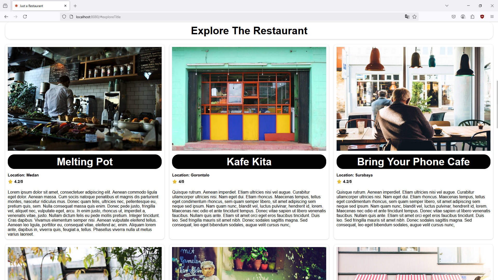

# Just-a-resto

Just-a-resto is a responsive, progressive web application (PWA) designed for restaurant listings. Developed as part of the Dicoding Front-End Web Developer Expert course, this project emphasizes modern web development practices, including performance optimization, accessibility, and comprehensive testing.

## Disclaimer

- Project ini dibuat pada tahun 2021 untuk menyelesaikan course dicoding berjudul [Belajar Pengembangan Web Intermediate](https://www.dicoding.com/academies/219)
- Berikut adalah sertifikat saya denga id: [1OP8LVJVQZQK](https://www.dicoding.com/certificates/1OP8LVJVQZQK)

### Kriteria submission pada saat itu

Fitur yang harus ada pada aplikasi:

- Integration Test
  - Menerapkan integration test untuk fungsi menyukai dan batal menyukai restoran.
- End to End Test
  - Menerapkan End to End Test dengan skenario: Menyukai salah satu restoran dan batal menyukai restoran tersebut
- Image Optimization.
  - Melakukan kompresi terhadap gambar hero yang digunakan. Ukuran gambar harus di bawah 200kb.
  - Menerapkan teknik image responsive pada gambar hero. Resolusi gambar pada layar seluler dan desktop harus berbeda.
  - Menerapkan teknik lazy loading pada gambar daftar restoran yang ditampilkan.
- Bundle Optimization
  - Memasang bundle analyzer pada proyek submission.
  - Gunakan teknik Code Splitting untuk memisahkan vendor code dari kode asli yang Anda tuliskan.
  - Pertahankan syarat yang ada pada submission sebelumnya. Seperti penerapan PWA, responsibilitas tampilan, aksesibilitas pada website dan sebagainya.

## Project Pictures

|  |  |
| :--------------------------------: | :-------------------------------------------------: |
|           Banner section           |               Restaurant list section               |

## Feature

- Responsive Design: Ensures optimal viewing across various devices.
- Progressive Web App (PWA): Offers offline capabilities and can be installed on devices.
- Favorite Restaurants: Users can like and unlike restaurants, with preferences stored locally.
- Image Optimization: Implements responsive images and compression techniques for faster load times.
- Testing Suite:

  - Integration Tests: Validates the functionality of liking and unliking restaurants.

  - End-to-End (E2E) Tests: Simulates user interactions to ensure seamless experiences.

## Project Structure

```
├── dist/                 # Compiled production files
├── e2e/                  # End-to-end test scripts
├── specs/                # Integration test specifications
├── src/                  # Source code
│   ├── public/
│   ├── scrips/
│   ├── styles/
│   └── templates/
├── webpack.common.js     # Webpack common configuration
├── webpack.dev.js        # Webpack development configuration
├── webpack.prod.js       # Webpack production configuration
├── package.json          # Project metadata and dependencies
└── README.md             # Project documentation
```

## Instalation

1. Clone the main repository

   ```
   git clone //main project
   cd Just-a-resto-main
   ```

2. Install Dependencies:
   ```
   npm install
   ```
3. Run Development Server:
   ```
   npm run start-dev
   ```
4. Build for Production:
   ```
   npm run build
   ```

## Testing

1. Integration test:
   ```
   npm run test
   ```
2. End-to-End Tests:
   ```
   npm run e2e
   ```

## Image Optimization

1. Build Optimized Images:

   ```
   npm run build-image
   ```

   This script utilizes sharp to compress and generate responsive images, ensuring they are under 200KB.
