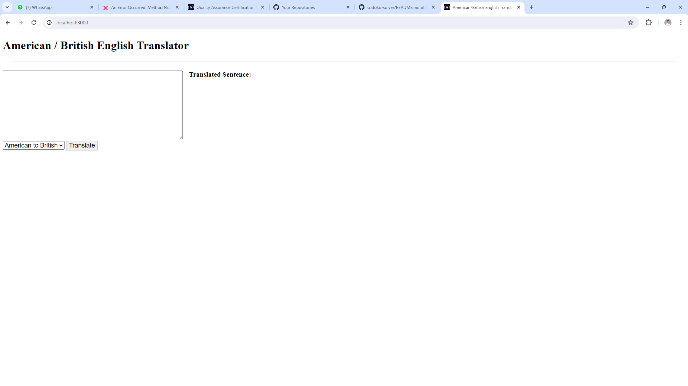

# 🇺🇸⇄🇬🇧 American-British Translator API

A RESTful translation microservice that converts text between **American** and **British English**, using predefined term dictionaries. Built with **Node.js** and **Express**, this project was developed for the **FreeCodeCamp Quality Assurance Certification** and is fully tested using **Mocha**, **Chai**, and **Chai-HTTP**.

> 🔎 Supports automated language localization and highlights translated terms.

---

## 🚀 Features

- Accepts POST requests with `text` and `locale`
- Supports both:
  - American → British (`american-to-british`)
  - British → American (`british-to-american`)
- Detects multiple terms per sentence
- Highlights translations in HTML `<span class="highlight">...</span>`
- Unit and functional test coverage
- Modular translation logic

---

## 🧠 Sample Input / Output

POST /api/translate

```json
{
  "text": "Mangoes are my favorite fruit.",
  "locale": "american-to-british"
}
```

Response

```json
{
  "text": "Mangoes are my favorite fruit.",
  "translation": "Mangoes are my <span class=\"highlight\">favourite</span> fruit."
}
```

## Project Picture



## 🗃️ Folder Structure

```
American-British-Translator/
├── components/          # Core translator logic
├── routes/              # API routing and request handling
├── tests/               # Mocha/Chai test cases
├── views/               # Basic HTML UI
├── public/              # Styles and assets
├── server.js            # Entry point
├── .env                 # Environment mode for testing
├── package.json
```

## 🧪 Unit & Functional Tests

> Set NODE_ENV=test in .env to run FreeCodeCamp tests.

### ✅ Unit Tests (components logic)

- American to British (e.g., "favorite" → "favourite")
- British to American (e.g., "footie match" → "soccer match")
- Highlight verification for replacements

### ✅ Functional Tests (API endpoint)

- Translation with valid fields
- Invalid locale field
- Missing text or locale
- Empty text input
- No translation needed

## 🔧 Getting Started

### 📥 Installation

```
git clone https://github.com/abrahamparn/American-British-Translator.git
cd American-British-Translator
npm install
```

### 🚀 Run Locally

```
npm start
```

Visit:

```
http://localhost:3000
```

### 📜 Technologies Used

- Node.js
- Express.js
- Mocha + Chai + Chai-HTTP (testing)
- HTML/CSS (minimal frontend)

### 🧠 What I Learned

- Managing term dictionaries and pattern matching
- Writing a string replacement engine with multiple rules
- Highlighting HTML responses for frontend visibility
- Testing RESTful endpoints using functional and unit tests
- Handling form validation and missing fields
