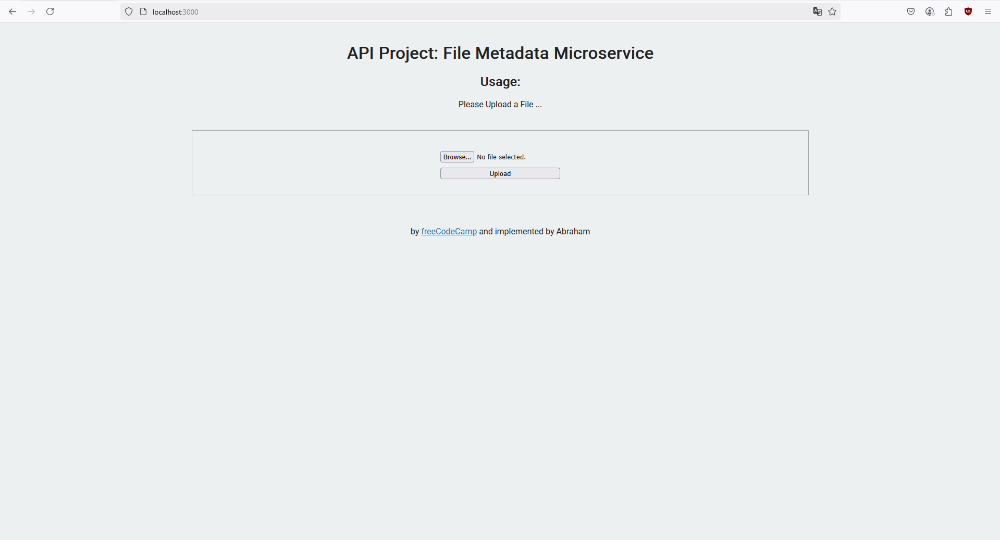

# 📁 File Metadata Microservice

**FileMetadata** is a backend microservice built using **Node.js**, **Express**, and **Multer** for file uploads. It follows a modular structure with basic routing and controller logic, and includes a test suite using **Jest**.

> 📦 This project is inspired by a FreeCodeCamp backend challenge and returns metadata for any file uploaded via an HTML form or API client.

---

## 🚀 Features

- Upload a file via form submission
- Parse and return file metadata:
  - Original name
  - MIME type
  - File size (in bytes)
- Supports `.env` config and local development
- Integrated test suite with Jest

---

## 📁 Folder Structure

```bash
FileMetadata-Project/
├── public/             # Static frontend (upload form)
├── src/                # Express app logic (routes, controllers)
│   ├── routes/
│   └── controllers/
├── views/              # Main upload page
├── index.js            # Entry point
├── .env                # Environment config (optional)
├── package.json
└── README.md
```

## Project Picture

## 

🧪 Getting Started

1. Clone the repo

   ```
   git clone # main repo
   cd file-metadata-project
   ```

2. Install dependencies

   ```
   npm install

   ```

3. Run the server (dev mode)
   ```
   npm run watch
   ```
   Visit the project at:
   ```
   http://localhost:3000
   ```

## How to Use

- Open the root page or use Postman to POST to /api/fileanalyse
- Upload a file
- Receive a response like:

  ```json
  {
    "name": "example.pdf",
    "type": "application/pdf",
    "size": 32768
  }
  ```

## 🧰 Tech Stack

- Node.js
- Express.js
- Multer (file upload middleware)
- HTML/CSS (simple frontend form)
- Jest (testing)

## 🧠 What I Learned

- Handling multipart/form-data with Express and Multer
- Structuring API logic with separation of concerns
- Using POST forms and file input in HTML
- Writing test cases for upload endpoint
