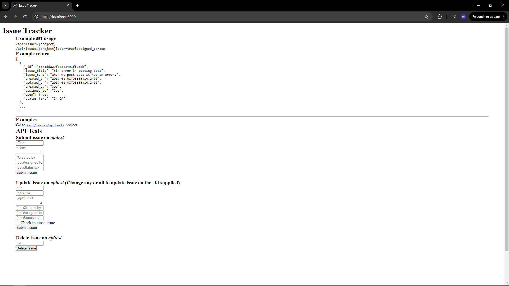

# 🐞 Issue Tracker API

A simple but complete **issue tracking API**, built with **Node.js**, **Express**, and basic testing using **Mocha + Chai + Supertest**. This project was developed as part of the **FreeCodeCamp Quality Assurance Certification** and meets all the required test cases and user stories.

> 🎯 Fully testable with both console and automated testing workflows

---

## 🚀 Features

- Create, read, update, and delete issues per project
- Supports filtering by multiple fields (open, assigned_to, etc.)
- Unique `_id` generation per issue
- Input validation and error handling
- Mocha/Chai-based functional test coverage
- Can be extended with MongoDB or persistent DB

---

## 📁 Folder Structure

```bash
Issue-Tracker/
├── routes/               # API route handlers
├── model/                # In-memory issue handling
├── services/             # Utility logic
├── tests/                # Mocha/Chai test definitions
├── views/                # HTML page (project UI)
├── public/               # Static CSS/JS assets
├── server.js             # Entry point
├── .env                  # Environment config
├── package.json
└── README.md
```

## Project picture

 

---

## 🚀 Getting Started

### 🔍 Prerequisites

- Node.js ≥ 14
- Internet access (for NPM dependencies)

### 📥 Installation

```
git clone # main repo
cd metric-imperial-converter
npm install
```

### .ENV setup

create a .env file and set this variables

```
MONGO_URL=your_mongodb_uri
NODE_ENV=development
PORT=3003
```

## ▶️ Running the App

```
npm run start
```

Navigate to:

```
http://localhost:3000/
```

Use the API via:

```
Visit http://localhost:3000/ to view the HTML interface.
```

## ✅ Running Tests

Run all tests:

```
npm run test
```

Make sure .env includes:

```
NODE_ENV=test
```

## 📝 API Overview

| Method | Route                | Description                |
| ------ | -------------------- | -------------------------- |
| POST   | /api/issues/:project | Create an issue            |
| GET    | /api/issues/:project | View issues (with filters) |
| PUT    | /api/issues/:project | Update one/multiple fields |
| DELETE | /api/issues/:project | Delete an issue by \_id    |

Supports filters like:
`GET /api/issues/project?open=true&assigned_to=developer1
`

## ✅ User Stories Covered

- Create issue with all fields
- Create issue with only required fields
- Create issue with missing fields
- View issues with no filter / one filter / many filters
- Update issues (single/multiple/missing/invalid)
- Delete issue (with/without \_id, invalid \_id)

All implemented in /routes/api.js and tested in /tests/2_functional-tests.js.

## What I Learned

- Building a CRUD API using Express
- Writing programmatic functional tests (Mocha + Chai + Supertest)
- Designing modular in-memory models for mock data
- Error handling and status code best practice
