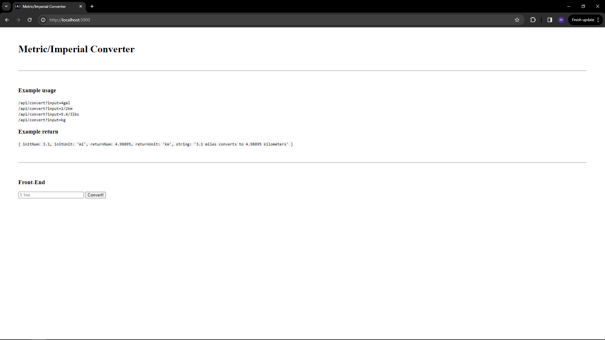

# 🔁 Metric-Imperial Converter

A RESTful API that converts values between **metric** and **imperial** units. Built with **Node.js** and **Express**, this microservice was developed as part of the FreeCodeCamp Quality Assurance Certification project.

> 🧪 Includes full unit and functional test coverage using **Mocha**, **Chai**, and **Supertest**.

---

## 📦 Features

- Accepts numeric input + unit from query parameters
- Supports:
  - Metric ↔ Imperial conversion (gal, L, mi, km, lbs, kg)
  - Fractional and decimal values (e.g. `3.5mi`, `1/2kg`, `1.2/3km`)
- Handles edge cases like:
  - Invalid units (`32g`)
  - Invalid number formats (`3/2/3kg`)
  - Missing values (`kg` defaults to `1kg`)
- Unit tests and functional tests are included and pass against FreeCodeCamp QA requirements

---

## 🔧 Tech Stack

- **Node.js**
- **Express.js**
- **Mocha & Chai** (for unit and functional testing)
- **Body-parser**
- **Helmet** (basic security headers)
- **Dotenv** for config management

---

## 📁 Project Structure

```bash
Metric-Imperial-Converter/
├── controllers/
│   └── convertHandler.js      # Conversion logic
├── routes/
│   └── api.js                 # Main API route: /api/convert
├── views/                     # Static frontend (optional)
├── tests/
│   ├── 1_unit-tests.js
│   └── 2_functional-tests.js
├── public/
├── server.js                  # Entry point
├── package.json
└── .env                       # (Optional) for NODE_ENV=test
```

## Project picture

 

---

## 🧪 Supported Units

| Input | Output |
| ----- | ------ |
| gal   | L      |
| L     | gal    |
| mi    | km     |
| km    | mi     |
| lbs   | kg     |
| kg    | lbs    |

## 🚀 Getting Started

### 🔍 Prerequisites

- Node.js ≥ 14
- Internet access (for NPM dependencies)

### 📥 Installation

```
git clone # main repo
cd metric-imperial-converter
npm install
```

## ▶️ Running the App

```
npm run start
```

Navigate to:

```
http://localhost:3000/
```

Use the API via:

```
GET /api/convert?input=10L
```

## ✅ Running Tests

Run all tests:

```
npm run test
```

Make sure .env includes:

```
NODE_ENV=test
```

## 🧪 Test Coverage Highlights

### Unit Tests

- Parses whole numbers, decimals, fractions
- Validates units
- Maps correct conversion pairs (e.g. gal → L)
- Correctly converts between units

### Functional Tests

- API response for valid input: /api/convert?input=10L
- Edge cases:
  - Invalid unit (32g)
  - Invalid number format (3/7.2/4kg)
  - Both invalid (3/7.2/4kilomegagram)
  - No number provided (kg defaults to 1kg)

## What I Learned

- How to design microservices with clean separation of concerns (controllers/routes)
- Input parsing, regex validation, and fraction logic
- How to implement robust testing for backend services
- Handling API edge cases cleanly and defensively
  #Metric-Imperial Converter
