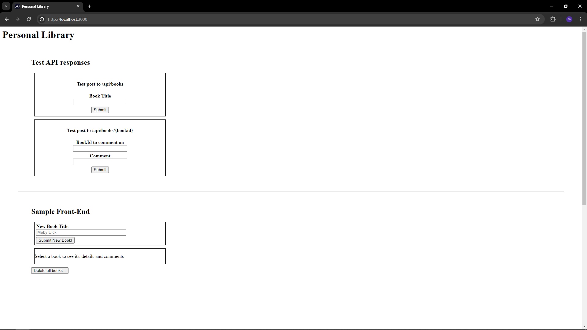

# 📚 Personal Library API

A RESTful book management API built using **Node.js**, **Express**, and **MongoDB**. This project was developed as part of the FreeCodeCamp Quality Assurance certification and includes complete functionality with CRUD operations, automated testing, and a basic HTML interface.

> ✅ All 10 required user stories and functional test cases are implemented and passing.

---

## 🚀 Features

- Add new books to a personal library
- View all books or individual book details
- Comment on books by ID
- Delete a specific book or wipe the entire library
- Return proper error messages on invalid input or missing data
- Integrated with **Mocha** + **Chai** functional tests
- Includes a simple UI for interacting with the API

---

## 📁 Folder Structure

```bash
Personal-Library/
├── routes/             # API endpoints
├── model/              # Mongoose schema for books
├── service/            # Controller logic
├── tests/              # Functional test suite
├── views/              # HTML frontend (index + forms)
├── public/             # Static assets (CSS)
├── server.js           # Main server file
├── .env                # MongoDB URI and ENV
├── package.json
└── README.md
```

## Project Picture



## 🧪 API Endpoints

| Method | Endpoint       | Description                       |
| ------ | -------------- | --------------------------------- |
| POST   | /api/books     | Add a new book (title required)   |
| GET    | /api/books     | List all books with comment count |
| GET    | /api/books/:id | Get details of a specific book    |
| POST   | /api/books/:id | Add a comment to a book           |
| DELETE | /api/books/:id | Delete a book by ID               |
| DELETE | /api/books     | Delete all books                  |

## 🔐 Environment Variables

In your .env file, add:

```
MONGO_URL=mongodb://your_mongo_connection_string
NODE_ENV=test
```

## 🧰 Technologies Used

- Node.js
- Express.js
- MongoDB (Mongoose)
- Chai + Mocha + Supertest (testing)
- HTML/CSS (for the frontend form)

## 🛠️ Getting Started

### ✅ Prerequisites

- Node.js (v14+)
- MongoDB Atlas URI or local MongoDB
- Internet connection

### ⚙️ Setup

```
git clone # main repo
cd Personal-Library
npm install
npm run start
```

> Visit: http://localhost:3000

## 🧪 Running Tests

Make sure your .env includes NODE_ENV=test.

Then run:

```
npm run test
```

> All 10 functional test cases required by FreeCodeCamp are implemented in /tests/2_functional-tests.js.

✅ Completed User Stories

- Add books to the collection
- Fetch all books with comment count
- Fetch individual book with comments
- Add comments to books
- Delete one or all booksHandle missing or invalid fields gracefully
- Pass all functional tests
