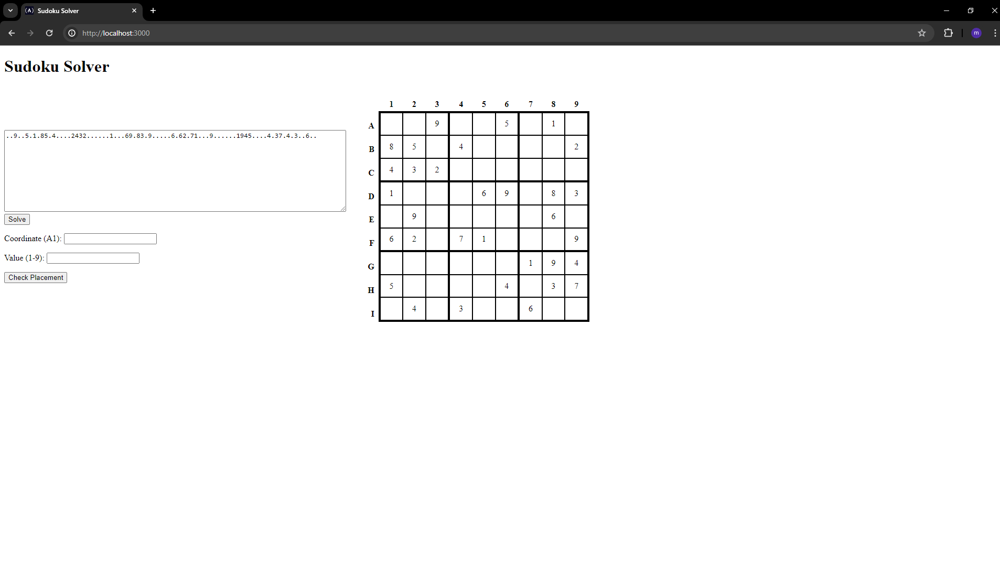

# 🔢 Sudoku Solver API

A RESTful API that validates and solves 9x9 Sudoku puzzles. This project was built with **Node.js** and **Express**, featuring comprehensive input validation and a custom backtracking solver algorithm. Developed as part of the **FreeCodeCamp Quality Assurance Certification**, it includes both unit and functional tests written in **Mocha**, **Chai**, and **Chai-HTTP**.

---

## 🚀 Features

- Accepts puzzle strings via API
- Validates:
  - Character set (`1-9` or `.`)
  - Input length (exactly 81 characters)
- Solves Sudoku puzzles using recursive backtracking
- API to check row, column, and region constraints
- Fully covered with unit and functional test cases
- Lightweight frontend for manual testing

---

## 📁 Folder Structure

```bash
sodoku-solver/
├── controllers/         # Core solver & validation logic
├── routes/              # API endpoints
├── tests/               # Unit + functional test suites
├── views/               # Frontend form interface
├── public/              # Static styles
├── server.js            # App entry point
├── .env                 # Environment configuration
└── package.json
```

## Project picture



## 🔧 Getting Started

1. Clone & Install

   ```
   git clone #main repository
   cd sodoku-solver
   npm install
   ```

2. Run the App

   ```
   npm start
   ```

   Visit the frontend at:

   > http://localhost:3000

## 🧪 Run Tests

To run the FreeCodeCamp-style tests:

```
NODE_ENV=test
npm run test
```

Includes:

- ✅ 11 unit tests (solver logic, validation, placement checking)
- ✅ 13 functional tests (API validation, solving, edge cases)

## 📬 API Overview

POST /api/solve

Solve a Sudoku puzzle.

```
{
  "puzzle": "1.5..2.84..63.12.7.2..5.....9..1....8.2.3674.3.....9..5....8..79.1.6....3.5..2.1"
}
```

Returns:

```
{ "solution": "135762984946381257728459613694517832812936745357824196581273469479618325263145978" }
```

### POST /api/check

Check if a placement is valid.

```
{
  "puzzle": "1.5..2.84..63.12.7.2..5.....9..1....8.2.3674.3.....9..5....8..79.1.6....3.5..2.1",
  "coordinate": "A2",
  "value": "3"
}
```

Returns:

```
{ "valid": true }
```

If invalid:

```
{ "valid": false, "conflict": ["row", "column"] }
```

## What I Learned

- Implementing Sudoku logic using backtracking
- Validating puzzle constraints across 3 dimensions
- Testing backend logic using Mocha, Chai, and Chai-HTTP
- Structuring Express apps with modular controllers and routing
- Working with grid coordinate logic (A-I, 1–9)
