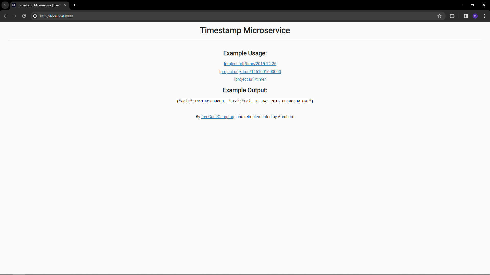

# ⏱️ TimerAPI – Timestamp Microservice

**TimerAPI** is a backend Node.js/Express application for backend certification project on a [FreeCodeCamp](https://www.freecodecamp.org/) [timestamp microservice project](https://www.freecodecamp.org/learn/back-end-development-and-apis/#back-end-development-and-apis-projects). This version includes a custom folder restructuring (MVC without model), improved routing logic, and test scripts.

> ⚙️ Built as part of [back end development and apis](https://www.freecodecamp.org/learn/back-end-development-and-apis/) certification — featuring request handling, URL parsing, and basic endpoint testing.

---

## 📸 Preview



---

## 📁 Folder Structure

```bash
TimerAPI/
├── public/           # Static assets like style.css
├── src/
│   ├── routes/       # Route handlers
│   ├── app.js        # Express app setup
│   └── server.js
├── views/            # HTML page(s) for root
├── logs/             # Server logs (optional)
├── package.json
├── README.md
```

## 🧪 How to Run This Project

1. Clone the repository:
   ```
   git clone # clone main repo
   cd timer-api
   ```
2. Install dependencies:

   ```
   npm install
   ```

3. Start the development server:
   ```
   npm run watch
   ```
4. Navigate to:
   ```
   http://localhost:3000
   ```

## 📌 API Usage

You can test the API manually or through Postman:

- `GET /api/:` returns current timestamp

- `GET /api/:date:` returns date in UNIX and UTC format
  - example: /api/2015-12-25 or /api/1450137600000

## 🧪 Run Tests

```
npm run test
```

> This executes the unit tests defined to validate timestamp parsing logic and endpoint correctness.

## 🧠 What I Learned

- Basic MVC folder structure for Express.js projects
- Building simple API endpoints with Express
- Parsing and validating UNIX and UTC date formats
- Adding basic unit tests to a backend projec
