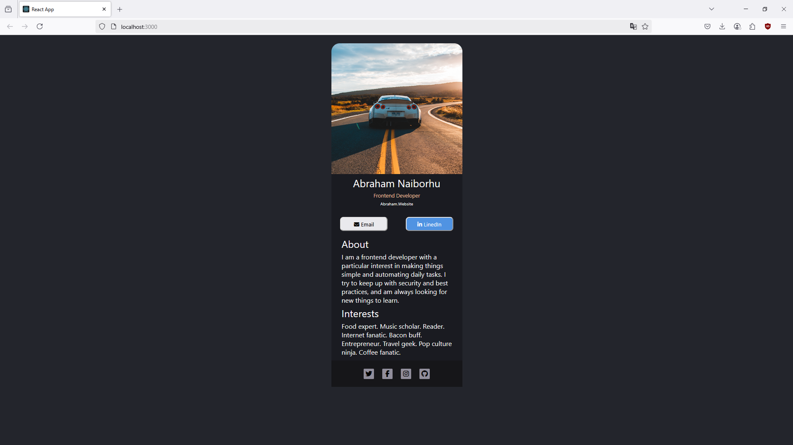

# 💼 Digital Business Card (React)

This is a simple, responsive **digital business card** built using **React** and bootstrapped with [Create React App](https://create-react-app.dev/). It serves as a personal online profile displaying contact details and branding.

---

## 📸 Preview



## 🚀 Getting Started

To run this project locally:

```bash
git clone https://github.com/abrahamparn/WEB-DEVELOPMENT-JOURNEY.git
cd business-card
npm install
npm start
```

This will start a local development server at:

```
http://localhost:3000
```

## Tech Stack

- React (via Create React App)
- HTML5 + CSS3
- JavaScript (ES6+)
- Fully responsive design

## 📁 Folder Structure

```
business-card/
├── public/
│   └── index.html
├── src/
│   ├── App.js
│   ├── index.js
│   └── styles/  # Custom CSS files (if any)
├── package.json
└── README.md
```

## 🎯 Features

- Personal branding and contact section
- Mobile-friendly layout
- Easy to deploy as a portfolio component or static page
- Minimal dependencies for fast performance

## 📦 Available Scripts

## Learnings

- Structure and organize a React-based single-page application (SPA)
- Use of public/ and src/ folders in CRA
- Responsive design techniques with plain CSS
- Setting up a clean deployment-ready React project
