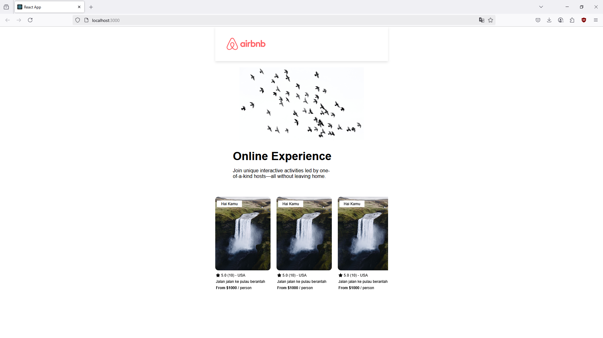

# 🏠 Airbnb Landing Page Clone (React)

This is a responsive **Airbnb landing page clone**, built using **React** and styled with CSS. It replicates Airbnb’s homepage layout, making it a great frontend UI practice project for applying component-based architecture and responsive layout techniques.

---

## 📸 Preview



---

# 🚀 Getting Started

To run the project locally:

```bash
git clone https://github.com/abrahamparn/copy-airbnb.git
cd copy-airbnb
npm install
npm start
```

Then open your browser and go to:

```
http://localhost:3000
```

## Tech Stack

- React (via Create React App)
- CSS (custom styling)
- JavaScript (ES6+)
- Component-based architecture

## 📁 Project Structure

```
copy-airbnb/
├── public/
│   └── index.html
├── src/
│   ├── components/       # Reusable UI components
│   ├── App.js
│   ├── index.js
│   └── App.css
├── package.json
└── README.md
```

## Features

- very simple Airbnb-like homepage design
- Responsive layout for mobile and desktop
- Clean and maintainable component structure
- Fast startup with Create React App

## 🧠 What I Learned

- Using Create React App for rapid prototyping
- Component-based UI design
- CSS styling for responsive and polished layouts
- Hands-on layout cloning practice for UI/UX sharpening
