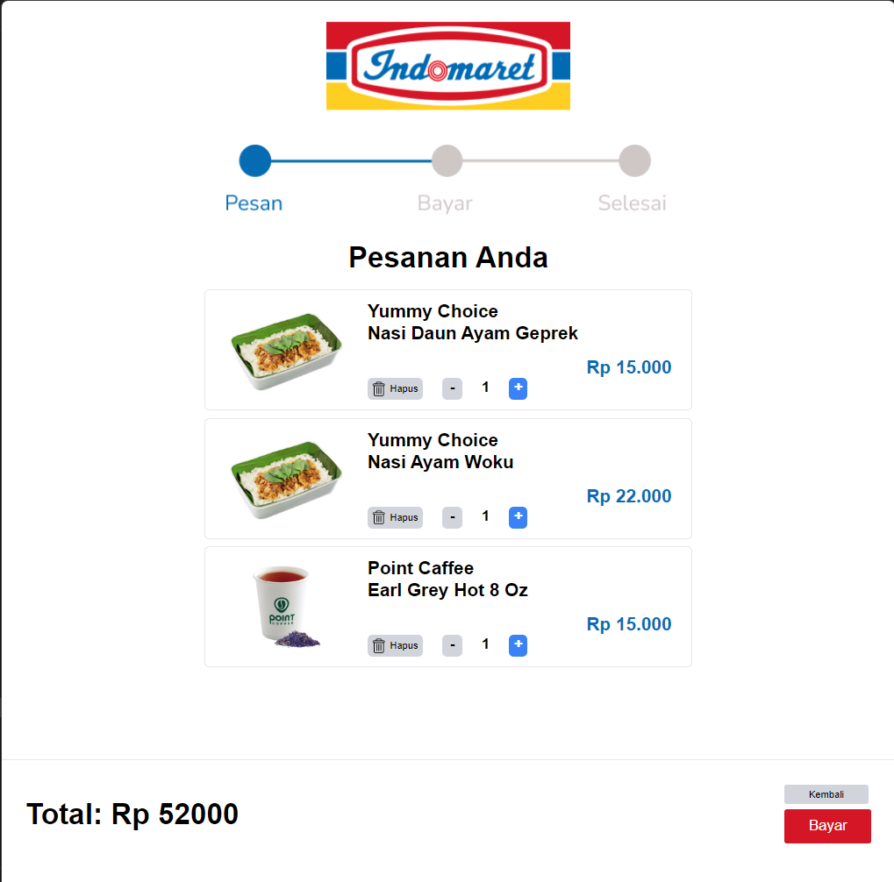
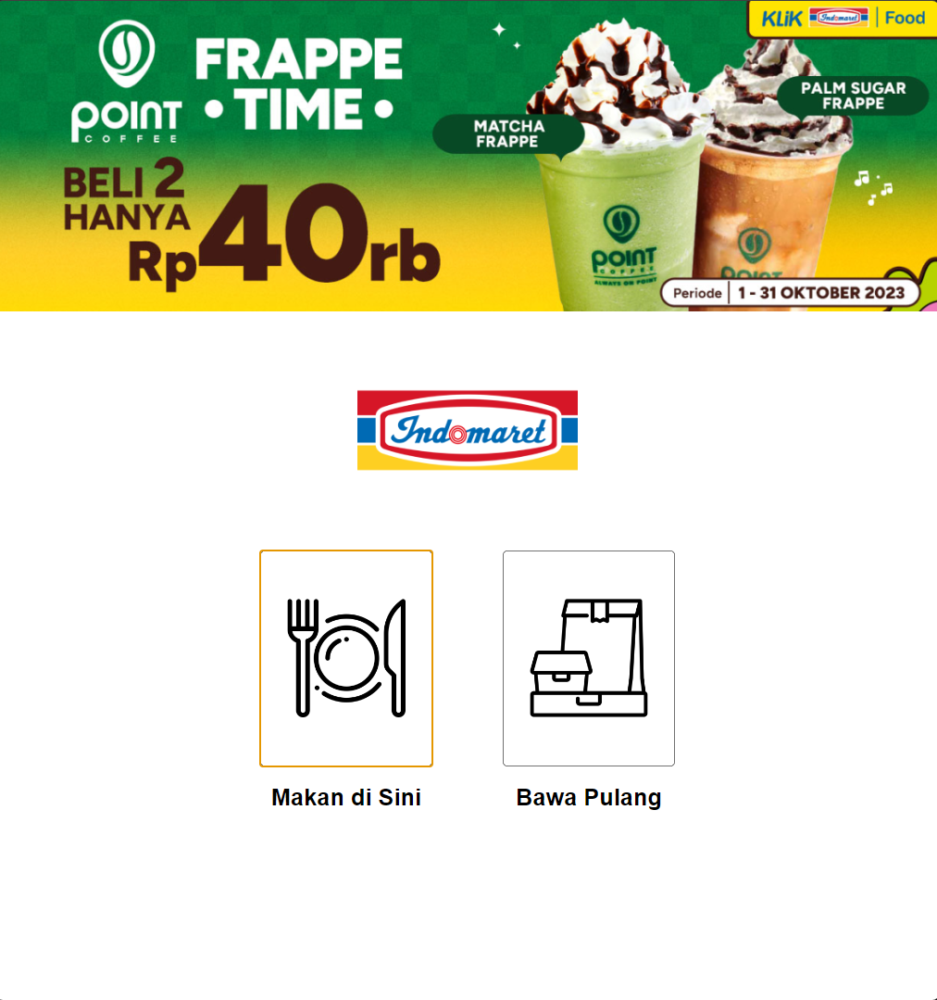
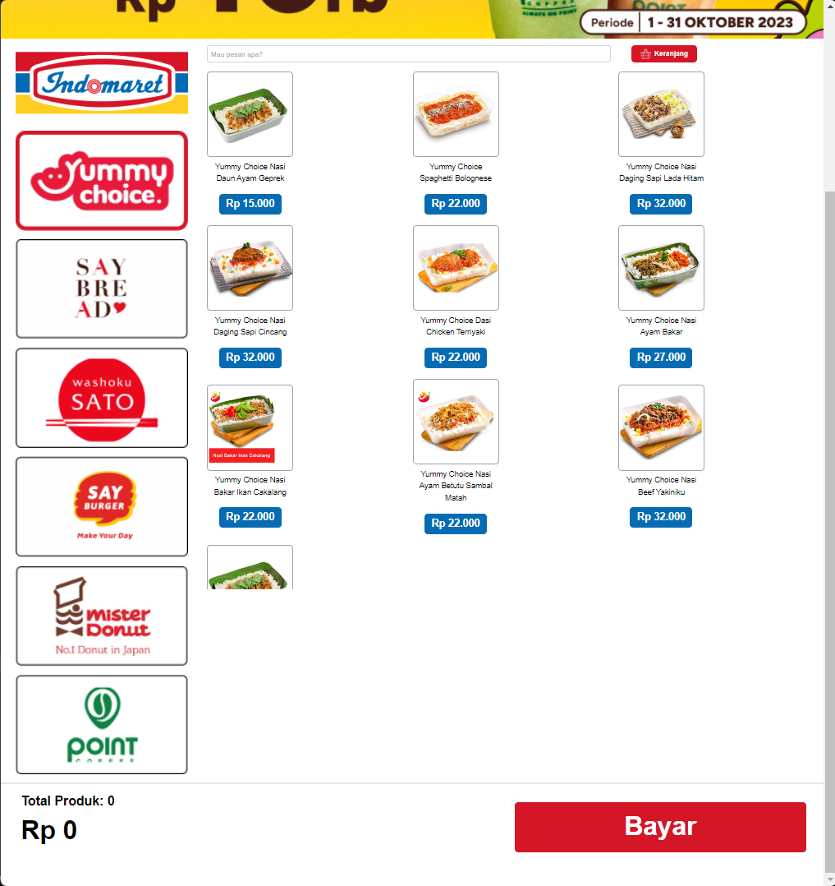
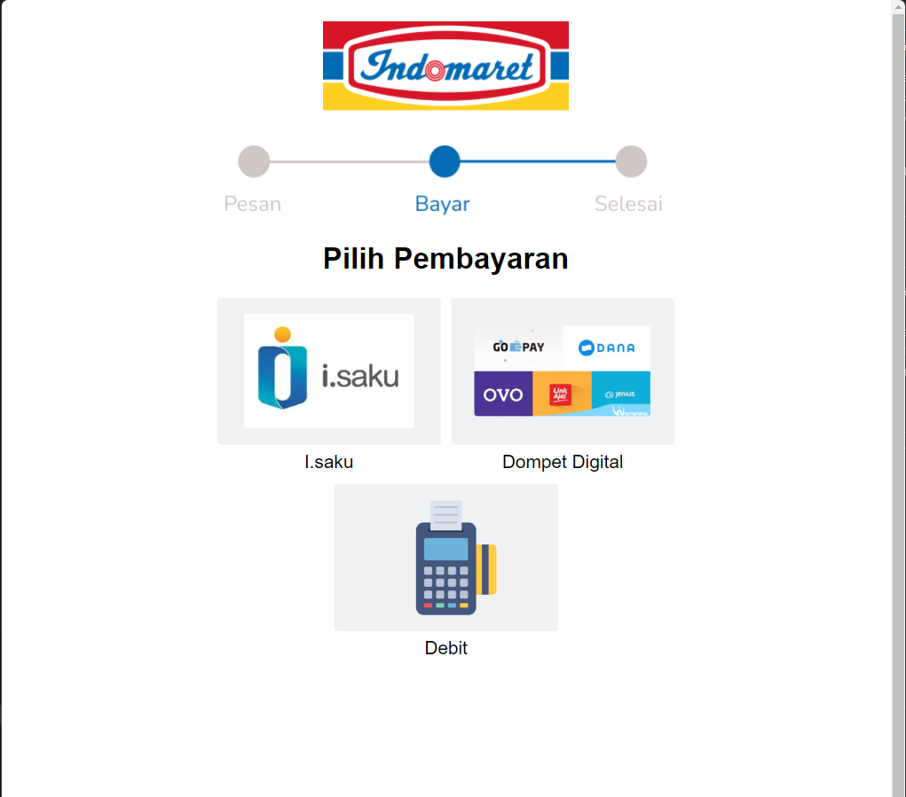

# 🛒 ClickIndomaret – React + Electron App

**ClickIndomaret** is a hybrid desktop application built with **React (via Vite)** and styled using **Tailwind CSS**, then wrapped as a desktop app using **Electron**. This project allows you to run a web-based UI either in the browser or as a native desktop app — combining the best of web and desktop worlds.

> ⚡ Developed with `vite` for fast frontend performance and `electron-builder` for cross-platform packaging.

---

## 📦 Tech Stack

- ⚛️ **React (Vite)** – SPA frontend framework
- 🎨 **Tailwind CSS** – Utility-first CSS framework
- 🧪 **Electron** – For desktop app wrapping
- 🛠️ **Electron Builder** – For packaging into `.exe`/`.app`
- 🚀 **Modern build tools** – Clean, performant, scalable

## Project Pictures

|  |  |
| :----------------------------: | :-------------------------------------------: |
|              Cart              |                 general menu                  |

|  |  |
| :-------------------------------------: | :----------------------------------: |
|                main menu                |               peyment                |

---

## 🚀 Getting Started

### ▶️ Run as a Web App (Vite Dev Mode)

```
cd ./click_indomaret
npm install
npm run dev
```

This will open:

```
http://localhost:5173/
```

### 🖥️ Run as an Electron Desktop App (Dev)

```
cd click-indomaret
npm install
cd ./click_indomaret
npm run build   # Build the frontend first
cd ..
npm run start   # Launch the Electron app
```

### 🏗️ Build Electron App (Windows)

```
npm run build:win
```

This uses electron-builder to generate a .exe under the build/ directory.

## 📁 Project Structure

```
click-indomaret/
├── click_indomaret/        # Frontend code (Vite + React + Tailwind)
│   ├── dist/               # Built frontend for Electron use
│   ├── src/                # Source components/pages
│   └── vite.config.js
├── main.js                 # Electron main process entry point
├── package.json            # App + builder config
└── build/                  # Output folder after building for desktop
```

## 🎯 Features

- Launches as either a web or desktop app
- Fast dev mode via Vite (npm run dev)
- Styled using Tailwind CSS
- Cross-platform build support with electron-builder
- Modular and scalable project structure

## 🧠 What I Learned

- Integrating Vite-based React apps into Electron
- Managing dual environments (browser and desktop)
- Handling build output and packaging with electron-builder
- Working with multi-level folder structures (Electron + Vite frontend)
