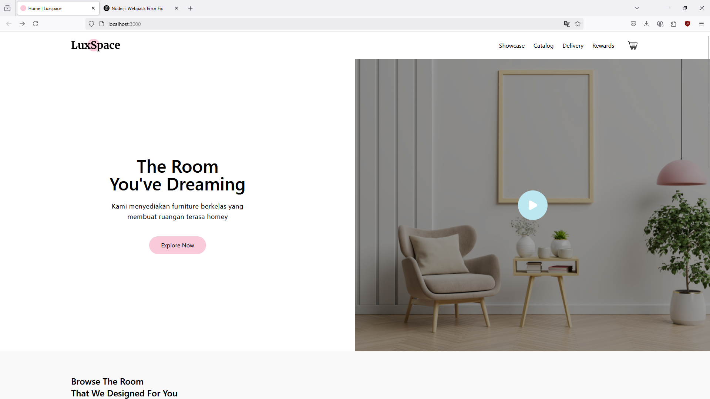
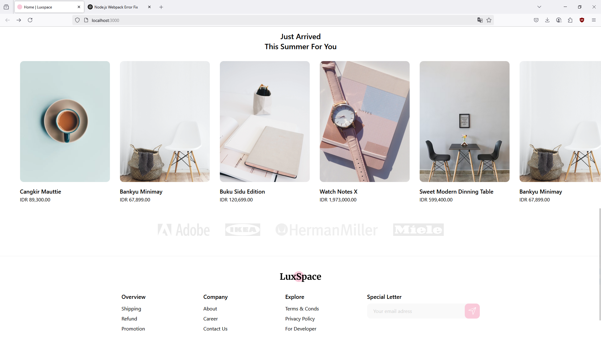
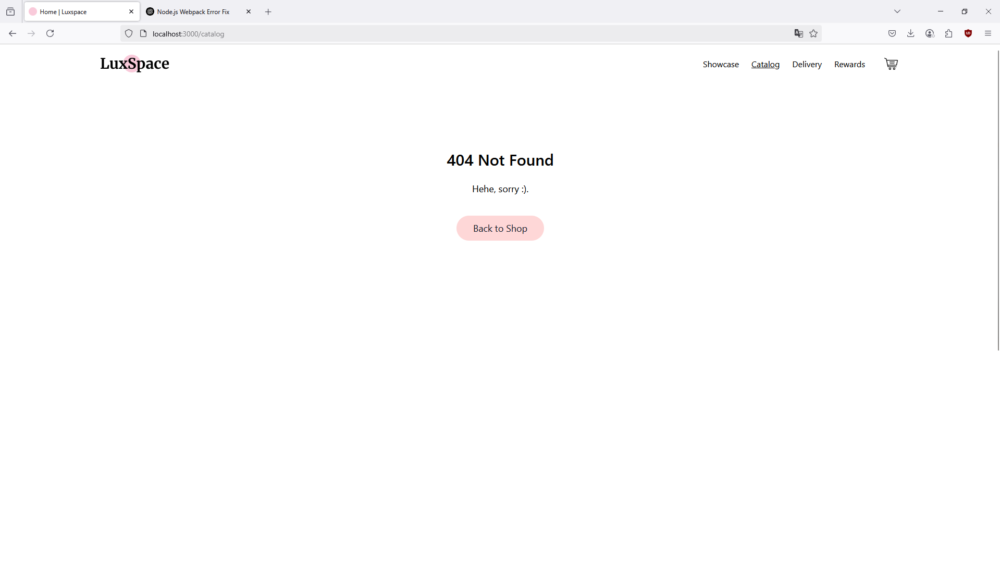
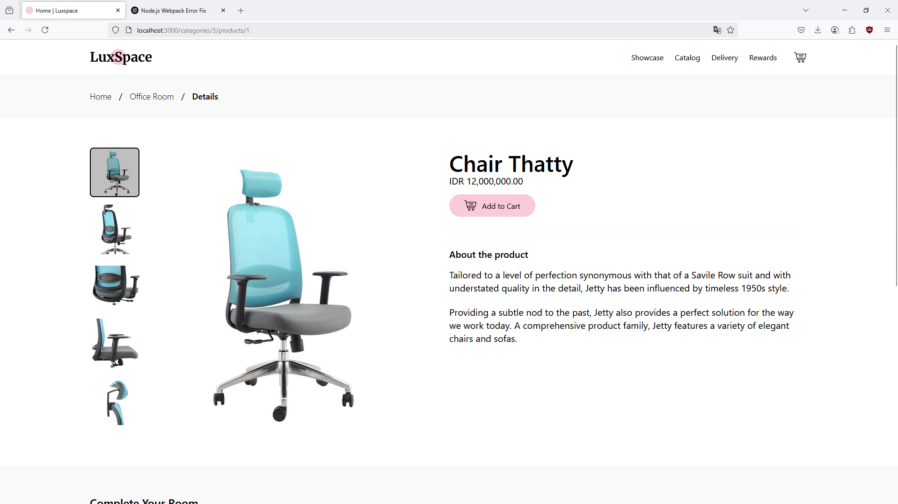

# 🛋️ LuxSpace Landing Page Clone

This project is a responsive, modern landing page built with **React.js** and **Tailwind CSS**, inspired by the LuxSpace furniture e-commerce site. It was created as part of the **BuildWithAngga (BWA)** front-end development course to practice modern component-based UI development.

> 🔧 Bootstrapped with Create React App (CRA) and styled with Tailwind for rapid UI building.

---

## Project Pictures

|  |  |
| :--------------------------------: | :----------------------------: |
|           Banner section           |    Restaurant list section     |

|  |  |
| :--------------------------: | :--------------------------------: |
|         404 section          |      Restaurant list section       |

---

## 🚀 Getting Started

To run this project locally:

```bash
git clone //main project
cd luxspace-bwa-course
npm install --legacy-peer-deps
npm start
```

Open your browser and navigate to:

```
http://localhost:3000
```

## 🧰 Tech Stack

- React (Create React App)
- Tailwind CSS (customized via tailwind.config.js)
- Component-based structure
- Craco for advanced config override
- Routing-ready base layout

## 📁 Project Structure

```
luxspace-bwa-course/
├── public/
│   └── index.html
├── src/
│   ├── components/     # Reusable UI components
│   ├── pages/          # Page-level layouts
|   ├── assets/
|   ├── helpers/
|   ├── parts/
│   ├── App.js
│   └── index.js
├── tailwind.config.js
├── craco.config.js
├── package.json
└── README.md
```

## Features

- Responsive, e-commerce-style landing page
- Clean and modular file structure
- Utility-first styling using Tailwind
- Layout inspired by real-world LuxSpace UI
- Ready for future extensions like routing or backend integration

## What I Learned

- Working with utility-first CSS frameworks (Tailwind)
- Structuring a scalable React project
- Customizing Tailwind with tailwind.config.js
- Overriding CRA config with craco
- Building pixel-perfect responsive UIs
