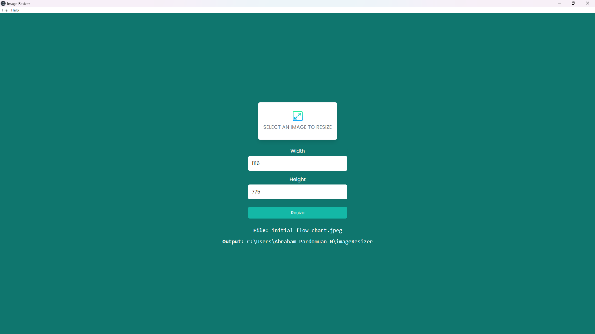

# 🖼️ Image Resizer Desktop App (Electron)

This is a cross-platform **image resizer desktop application** built with **Electron**, using HTML, CSS, and JavaScript. The app allows users to select an image from their filesystem and resize it with ease — packed into a lightweight `.exe` or `.dmg` desktop application.

> 🧪 Built using Electron’s main/renderer process architecture with basic UI rendering and file handling logic.

---

## 📸 Preview



---

## 🚀 Getting Started

### 🖥️ Run in Dev Mode

```bash
git clone https://github.com/abrahamparn/IMAGERESIZEELECTRON.git
cd IMAGERESIZEELECTRON
npm install
npm start
```

### 🏗️ Build Executable

To generate the .exe or platform-specific binary:

```
npm run build
```

📁 The generated binary will appear under the dist/ folder (based on Electron Forge or builder config).

## Tech Stack

- Electron — Desktop shell using Chromium + Node.js
- HTML/CSS/JavaScript — Renderer process UI
- Node.js + npm — Runtime and dependency management

## 📁 Project Structure

```
image-resize-electron/
├── assets/              # Static files (logo, icons)
├── renderer/            # HTML, CSS, JS for renderer window
├── main.js              # Electron main process
├── preload.js           # Preload script (optional)
├── package.json         # Project metadata and scripts
├── README.md
```

## Features

- Select and resize images easily
- Lightweight UI with minimal dependencies
- Works offline — fully local processing
- Cross-platform build support
- Built with native Electron APIs

## What I Learned

- How to build a desktop application using Electron
- Differences between main and renderer processes
- Packaging Electron apps for distribution
- Managing file I/O in Node.js environment
- Creating cross-platform tools from web technologies
