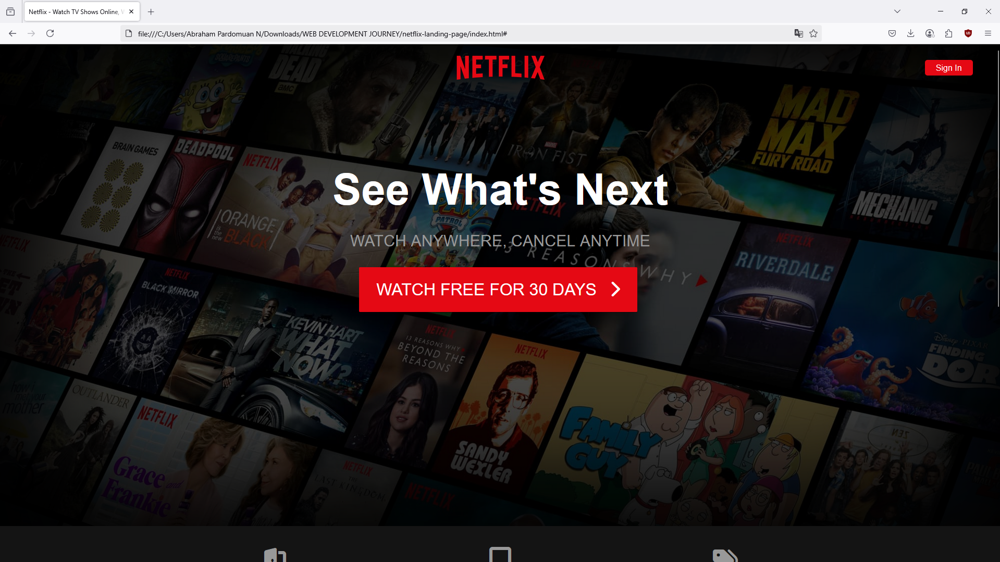
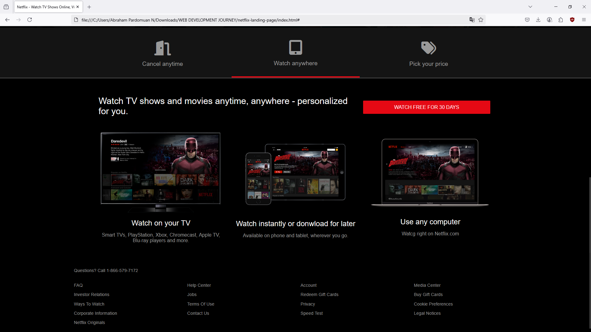

# 🎬 Netflix Landing Page Clone

This is a simple, responsive **Netflix landing page clone**, built using **HTML, CSS, and JavaScript**. The layout and styling are inspired by Netflix's official homepage and was built as a frontend UI exercise based on a tutorial by [Traversy Media](https://www.youtube.com/watch?v=27JtRAI3QO8).

> 💡 This project focuses purely on frontend UI/UX structure and does not include backend functionality (e.g., login, database, etc.)

---

## 📸 Demo Preview

|  |  |
| :--------------------------------: | :-------------------------------: |
|         Top Banner Section         |      Featured Shows Section       |

> 📂 All images are located under `/img`, and styling is under `/css/style.css`.

---

## 🚀 Live Preview

No live site yet. To run locally:

```bash
git clone https://github.com/abrahamparn/WEB-DEVELOPMENT-JOURNEY.git
cd Netflix-Landing-Page
open index.html
```

## 🛠️ Built With

- HTML5 – Semantic layout structure
- CSS3 – Flexbox, Grid, Responsive Design
- Vanilla JavaScript – Minimal JS for interactivity
- Font Awesome – Icons

## project structure

```
Netflix-Landing-Page/
├── css/
│   └── style.css
├── js/
│   └── script.js
├── img/
│   ├── banner.jpg
│   └── ...other assets
├── index.html
└── readme.md

```

## Features

- 🎥 Netflix-inspired homepage layout
- 📱 Fully responsive (mobile, tablet, desktop)
- 🖼️ Image-based hero and content sections
- ⚡ Fast loading and minimal dependencies

## 🧠 Learnings

This project helped reinforce:

- Mobile-first CSS design patterns
- Modern layout techniques (Flexbox/Grid)
- Building pixel-perfect UIs
- Structuring components in clean, semantic HTML
